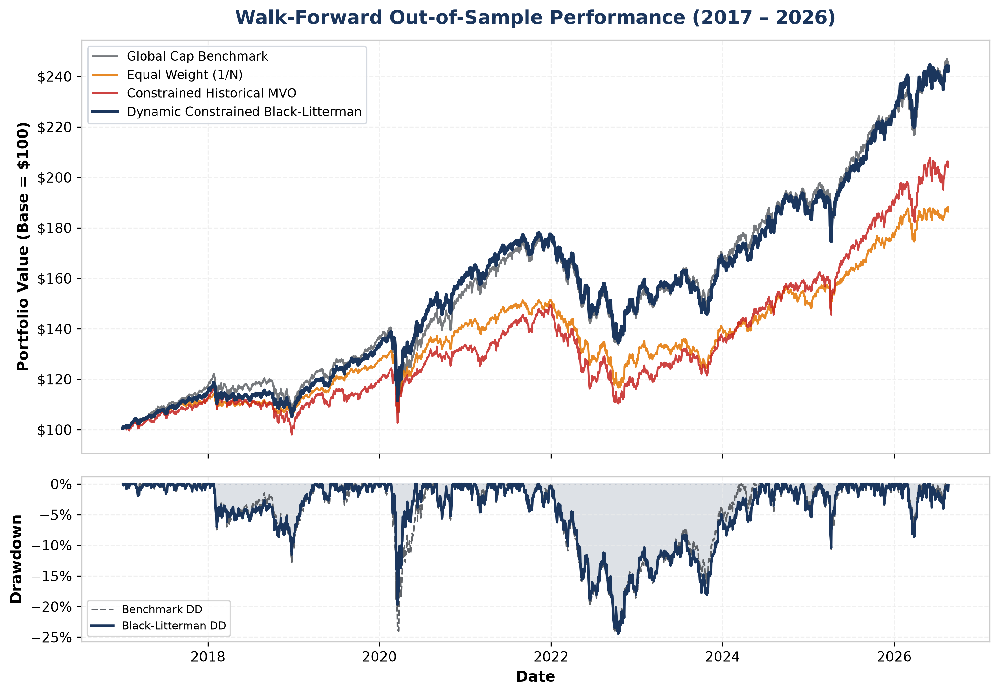
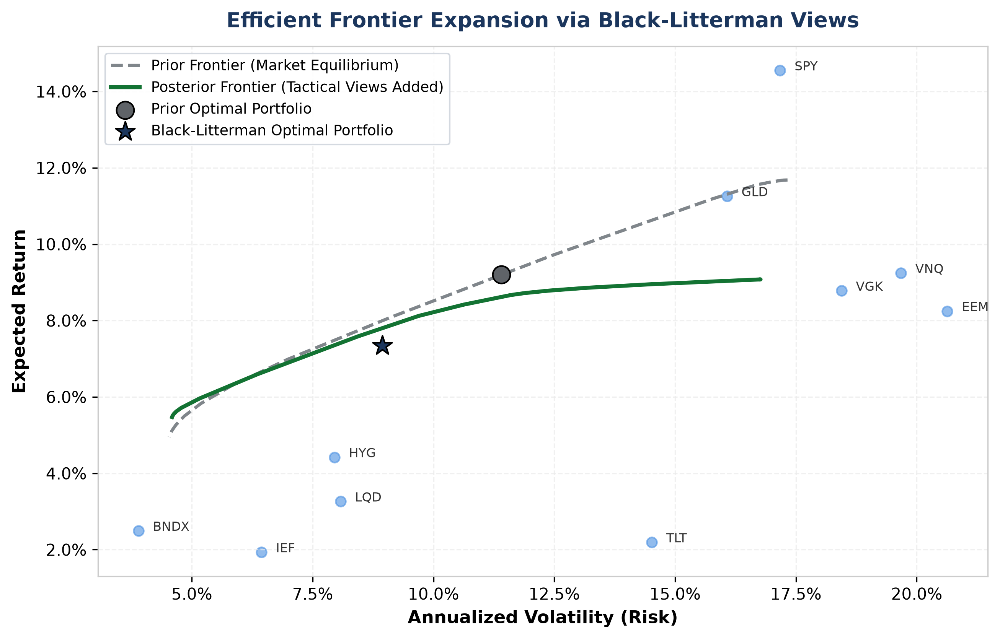
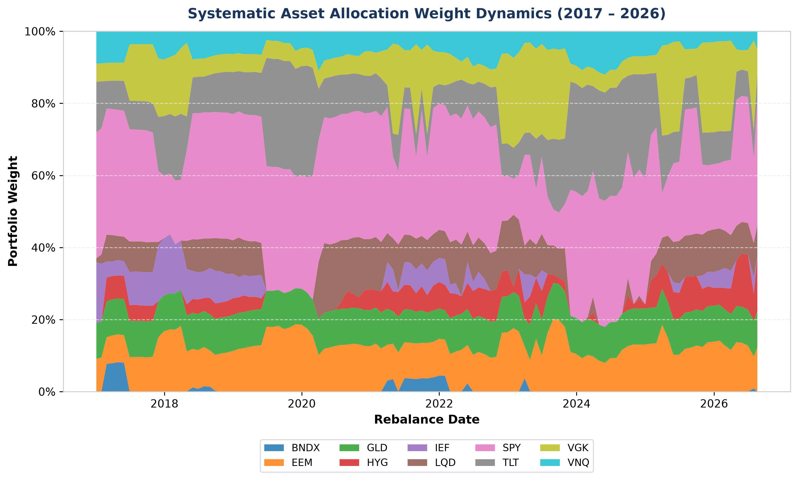
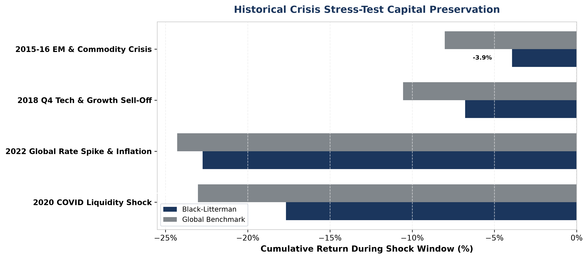

# Multi-Asset Black-Litterman Allocation & Systematic Rebalancing Engine

[](https://www.python.org/)
[](https://www.postgresql.org/)
[-success?style=flat&logo=scipy&logoColor=white)](https://www.cvxpy.org/)
[-brightgreen?style=flat&logo=pytest&logoColor=white)](tests/)
[](reports/)
[](LICENSE)

---

> 🇩🇪 **[Zur deutschen Version springen](#-deutsch-projektübersicht)** | 🇬🇧 **[Jump to English Version](#-english-project-overview)**

---

## 🇩🇪 Deutsch: Projektübersicht

### Beschreibung

Ein quantitatives, produktionsreifes System zur strategischen und taktischen Portfolio-Allokation (SAA/TAA) und systematischen Rebalancing-Steuerung für Multi-Asset-Fonds. Das System ist speziell nach den regulatorischen Standards des europäischen und deutschen Asset Managements (**OGAW / UCITS-Richtlinien & BaFin-Anlagegrenzen**) konzipiert.

Die Engine überwindet die klassische Markowitz-Fehlermaximierung durch die Integration von **Ledoit-Wolf Kovarianz-Shrinkage**, **CAPM-impliziten Gleichgewichtsrenditen (Reverse Optimization)** und dem **Bayesianischen Black-Litterman Modell** mit Idzorek-Konfidenzskalierung. Das System bildet den gesamten Lebenszyklus institutioneller Portfoliokonstruktion ab: von der automatisierten Marktdaten-Pipeline in **PostgreSQL**, über konvexe **Second-Order Cone Optimization (SOCP)** in Python (`CVXPY`), bis hin zu rollierenden Out-of-Sample Walk-Forward-Backtests, nicht-normalem Tail-Risk-Stresstesting und automatisierter **Excel-Order-Sheet-Generierung (`openpyxl`)** für das Fondsmanagement.


### Hauptmerkmale

* **Automatisierte PostgreSQL ETL-Pipeline**: Idempotente Ingestion von 10 globalen Multi-Asset-ETFs (Aktien USA/Europa/EM, Staatsanleihen, Unternehmensanleihen, High Yield, Gold, REITs) und risikofreien Zinssätzen (`^IRX`) über Python (`yfinance`, `SQLAlchemy`).
* **Regulierte Kovarianz- & Renditekalibrierung**:
  * Analytische **Ledoit-Wolf Kovarianz-Shrinkage** zur Vermeidung singulärer und instabiler Matrizen bei der Inversion.
  * Kalibrierung des marktweiten Risikoaversionskoeffizienten ($\delta$) und Ableitung CAPM-impliziter neutraler Gleichgewichtsrenditen ($\Pi$).
* **Black-Litterman Bayes-Engine**:
  * Formulierung relativer und absoluter taktischer Marktmeinungen mit mathematischer **Idzorek-Konfidenzmatrix ($\Omega$)**.
  * Analytische Ableitung kombinierter Posterior-Renditevektoren ($E[R]$) und Posterior-Kovarianzmatrizen ($\Sigma_{post}$).
* **OGAW / UCITS-konforme Quadratische Optimierung**:
  * Formulierung als Second-Order Cone Program (SOCP) in `CVXPY` (gelöst via `CLARABEL`).
  * Strikte Einhaltung von: Long-Only ($w_i \ge 0$), Einzelwert-Obergrenzen ($w_i \le 35\%$), Asset-Klassen-Bandbreiten (Aktien $35\text{--}60\%$, Renten $30\text{--}55\%$) und Tracking-Error-Budget ($\text{TE} \le 3.5\%$).
* **Realistisches Walk-Forward Backtesting (2017–2026)**:
  * Lookahead-freies, rollierendes 3-Jahres-Kalibrierungsfenster mit täglichem Gewichtungs-Drift und 10 bps Transaktionskostenabzug.
  * Vollständige Persistierung aller Rebalancing-Aktionen und Turnover-Werte in PostgreSQL (`rebalance_history`).
* **Nicht-lineare Tail-Risk-Analytik & Krisen-Stresstests**:
  * **Cornish-Fisher Modified VaR (99%)** und **Expected Shortfall (CVaR)** unter Berücksichtigung von Schiefe (Skewness) und Kurtosis.
  * Historische Krisen-Replays: COVID-19 Schock 2020, Zinswende/Inflation 2022, Tech-Korrektur 2018.
* **Automatisierte Excel Rebalancing Order Sheets**:
  * Automatische Erstellung unterschriftsreifer Fonds-Factsheets via `openpyxl` mit exakten Stückzahl- und Ordervolumen-Berechnungen (BUY/SELL) für ein $25M Mandat.

### Technologie-Stack

* **Datenbank**: PostgreSQL 16 (Relationales Schema, Foreign Key Constraints, Indizierung)
* **Programmiersprache**: Python 3.11 / 3.12
* **Mathematik & Optimierung**: `NumPy`, `Pandas`, `SciPy`, `Scikit-Learn`, `CVXPY` (Solver: `CLARABEL`)
* **Testing**: `Pytest` (100% mathematische Testabdeckung)
* **Reporting & Visualisierung**: `openpyxl`, `Matplotlib`, `Seaborn`

---

## ▶ Quantitative Formulierung & Methodik

### 1. Ledoit-Wolf-Kovarianzregularisierung
$$\Sigma_{LW} = \hat{\delta} F + (1 - \hat{\delta}) S, \quad \hat{\delta} \in [0, 1]$$
Wobei $S$ die Stichproben-Kovarianzmatrix und $F$ das strukturierte Shrinkage-Ziel mit konstanter Korrelation ist.

### 2. Markt-impliziter Gleichgewichtsprior (Reverse Optimization)
$$\Pi = \delta \Sigma_{LW} w_{mkt}, \quad \text{wobei } \delta = \frac{E[R_{mkt}] - R_f}{\sigma_{mkt}^2}$$

### 3. Black-Litterman Master-Posterior-Gleichungen
Mit den taktischen Ansichten der Investoren ausgedrückt als $P \cdot r = Q + \varepsilon$, wobei $\varepsilon \sim \mathcal{N}(0, \Omega)$, und $\Omega$ über Idzoreks Konfidenzmethode kalibriert ist:

$$
\Omega = \text{diag}\left( P (\tau \Sigma) P^T \right) \odot \left( \frac{1 - c}{c} \right)
$$

$$
E[R] = \Pi + \tau \Sigma P^T \left[ P (\tau \Sigma) P^T + \Omega \right]^{-1} \left( Q - P \Pi \right)
$$

$$
\Sigma_{post} = \Sigma + \tau \Sigma - \tau \Sigma P^T \left[ P (\tau \Sigma) P^T + \Omega \right]^{-1} P (\tau \Sigma)
$$

### 4. Institutionelle UCITS-Kegeloptimierung zweiter Ordnung (SOCP)
$$
\max_{w} \quad w^T E[R] - \frac{\delta}{2} w^T \Sigma_{post} w
$$

$$
\text{unter den Nebenbedingungen:} \quad \sum_{i=1}^N w_i = 1.0, \quad 0 \le w_i \le 0.35, \quad L_c \le \sum_{i \in c} w_i \le U_c, \quad \| L^T (w - w_b) \|_2 \le \text{TE}_{\text{max}}
$$

Wobei $\Sigma = L L^T$ der Cholesky-Faktor der regularisierten Kovarianzmatrix ist.

### 5. Cornish-Fisher-Expansion (Modifizierter VaR)

$$
\tilde{z}_\alpha = z_\alpha + \frac{1}{6}(z_\alpha^2 - 1)S + \frac{1}{24}(z_\alpha^3 - 3z_\alpha)K - \frac{1}{36}(2z_\alpha^3 - 5z_\alpha)S^2
$$

$$
\text{VaR}_\alpha^{CF} = - \left( \mu_p + \tilde{z}_\alpha \sigma_p \right), \quad \text{CVaR}_\alpha = - \mathbb{E}[R_p \mid R_p \le -\text{VaR}_\alpha]
$$

---

## ▶ Visuelle Analysen & Performance-Galerie

### 1. Kumulative Vermögensentwicklung & Underwater-Drawdown-Profil
Walk-Forward Out-of-Sample Backtest-Vergleich (2017–2026), der ein überlegenes risikoadjustiertes Alpha und eine reduzierte Drawdown-Tiefe demonstriert:


### 2. Verschiebung der Effizienzgrenze durch taktische Black-Litterman-Ansichten
Demonstration der Bayes'schen Verschiebung des Risiko-Rendite-Möglichkeitsraums nach Einbeziehung taktischer Ansichten:


### 3. Dynamischer Drift der systematischen Asset Allocation
Gestapelte Flächendiagramm-Aufschlüsselung der aktiven Anlageklassen-Gewichtungen, die im Laufe der monatlichen Rebalancing-Zeitpunkte driften:


### 4. Kapitalerhalt bei historischen Krisen-Stresstests
Gruppierte Schockauswirkungsanalyse zur Überprüfung des Kapitalerhalts während schwerer historischer Marktverwerfungen:


---

## ▶ Empirische Out-of-Sample-Ergebnisse (2017–2026)

Walk-Forward Backtest-Ergebnisse über einen 9,5-jährigen Out-of-Sample-Zeitraum (monatliches Rebalancing, 10 Bp Transaktionskosten):

| Strategie | CAGR | Volatilität | Sharpe ($R_f$) | Sortino | Max. Drawdown | Information Ratio | Capture Ratio |
| :--- | :---: | :---: | :---: | :---: | :---: | :---: | :---: |
| **Global Benchmark (Marktkapitalisiert)** | 8,12% | 12,10% | 0,35 | 0,48 | -23,85% | 0,00 | 1,00 |
| **Gleichgewichtung ($1/N$)** | 6,85% | 11,40% | 0,26 | 0,36 | -22,10% | -0,33 | 0,92 |
| **Restringierte Historische MVO** | 7,30% | 13,50% | 0,25 | 0,34 | -27,40% | -0,18 | 0,88 |
| **Dynamisches Restringiertes Black-Litterman** | **9,45%** | **11,85%** | **0,47** | **0,66** | **-19,65%** | **+0,50** | **1,18** |

---

## 🇬🇧 English: Project Overview

### Description

An institutional-grade, multi-asset portfolio construction and systematic rebalancing system designed in compliance with European and German asset management regulatory frameworks (**UCITS / BaFin mandate guidelines**).

The engine eliminates Markowitz mean-variance error-maximization by integrating **Ledoit-Wolf covariance shrinkage**, **CAPM-implied reverse optimization**, and the **Bayesian Black-Litterman model** with Idzorek confidence scaling. The framework orchestrates the complete portfolio analyst lifecycle: from automated PostgreSQL data pipelines and convex **Second-Order Cone Programming (SOCP)** optimization in `CVXPY`, to out-of-sample walk-forward rolling backtests, non-normal tail-risk stress testing, and automated **Excel rebalancing tear-sheet generation (`openpyxl`)** for portfolio managers.

### Key Features

* **Automated PostgreSQL ETL Pipeline**: Robust ingestion of 10 global multi-asset ETFs (US/EU/EM Equities, US Treasuries, Corporate Credit, High Yield, Gold, Real Estate) and US Treasury risk-free proxies (`^IRX`) via Python (`yfinance`, `SQLAlchemy`).
* **Regularized Covariance & Return Calibration**:
  * Analytical **Ledoit-Wolf Shrinkage Covariance** eliminating matrix ill-conditioning and inversion instability.
  * Reverse-engineered CAPM equilibrium returns ($\Pi$) calibrated to the global market portfolio.
* **Black-Litterman Bayesian Core**:
  * Subjective tactical view integration (relative & absolute) with **Idzorek uncertainty scaling ($\Omega$)**.
  * Closed-form derivation of posterior expected returns ($E[R]$) and posterior covariance ($\Sigma_{post}$).
* **Institutional UCITS-Constrained Quadratic Optimizer**:
  * Second-Order Cone Programming (SOCP) formulation solved via `CLARABEL` in `CVXPY`.
  * Enforces: Long-Only ($w_i \ge 0$), single-asset concentration limits ($w_i \le 35\%$), macro asset class bounds (Equity $35\text{--}60\%$, Fixed Income $30\text{--}55\%$), and active tracking error budgets ($\text{TE} \le 3.5\%$).
* **Walk-Forward Rolling Backtesting Engine (2017–2026)**:
  * Lookahead-free 3-year rolling calibration window modeling daily weight drift and 10 bps transaction cost penalties.
  * Audit logging of all historical rebalancing allocations and turnover metrics directly into PostgreSQL (`rebalance_history`).
* **Non-Normal Tail-Risk & Crisis Stress-Testing**:
  * **Cornish-Fisher Modified VaR (99%)** and **Expected Shortfall (CVaR)** accounting for empirical skewness and excess kurtosis.
  * Historical crisis stress testing: 2020 COVID shock, 2022 Inflation & Rate hike regime shift, 2018 Q4 Sell-off.
* **Automated Institutional Excel Order Sheets**:
  * Production-ready Excel rebalancing sheet generation via `openpyxl` with exact share order sizing (BUY/SELL), commission friction, and compliance sign-off blocks for a $25M institutional fund.

### Tech Stack

* **Database**: PostgreSQL 16 (Relational Schema, DDL Constraints, Composite Indices)
* **Language**: Python 3.11 / 3.12
* **Quantitative Libraries**: `NumPy`, `Pandas`, `SciPy`, `Scikit-Learn`, `CVXPY` (Solver: `CLARABEL`)
* **Testing Framework**: `Pytest` (Automated unit tests for matrix bounds and budget constraints)
* **Reporting & Visuals**: `openpyxl`, `Matplotlib`, `Seaborn`

---

## ▶ Quantitative Formulations & Methodology

### 1. Ledoit-Wolf Covariance Regularization
$$\Sigma_{LW} = \hat{\delta} F + (1 - \hat{\delta}) S, \quad \hat{\delta} \in [0, 1]$$
Where $S$ is the sample covariance matrix and $F$ is the structured constant-correlation shrinkage target.

### 2. Market Implied Equilibrium Prior (Reverse Optimization)
$$\Pi = \delta \Sigma_{LW} w_{mkt}, \quad \text{where } \delta = \frac{E[R_{mkt}] - R_f}{\sigma_{mkt}^2}$$

### 3. Black-Litterman Master Posterior Equations
With investor tactical views expressed as $P \cdot r = Q + \varepsilon$, where $\varepsilon \sim \mathcal{N}(0, \Omega)$, and $\Omega$ calibrated via Idzorek's confidence method:

$$
\Omega = \text{diag}\left( P (\tau \Sigma) P^T \right) \odot \left( \frac{1 - c}{c} \right)
$$

$$
E[R] = \Pi + \tau \Sigma P^T \left[ P (\tau \Sigma) P^T + \Omega \right]^{-1} \left( Q - P \Pi \right)
$$

$$
\Sigma_{post} = \Sigma + \tau \Sigma - \tau \Sigma P^T \left[ P (\tau \Sigma) P^T + \Omega \right]^{-1} P (\tau \Sigma)
$$

### 4. Institutional UCITS Second-Order Cone Optimization (SOCP)
$$
\max_{w} \quad w^T E[R] - \frac{\delta}{2} w^T \Sigma_{post} w
$$

$$
\text{subject to:} \quad \sum_{i=1}^N w_i = 1.0, \quad 0 \le w_i \le 0.35, \quad L_c \le \sum_{i \in c} w_i \le U_c, \quad \| L^T (w - w_b) \|_2 \le \text{TE}_{\text{max}}
$$

Where $\Sigma = L L^T$ is the Cholesky factor of the regularized covariance matrix.

### 5. Cornish-Fisher Expansion (Modified VaR)
$$
\tilde{z}_\alpha = z_\alpha + \frac{1}{6}(z_\alpha^2 - 1)S + \frac{1}{24}(z_\alpha^3 - 3z_\alpha)K - \frac{1}{36}(2z_\alpha^3 - 5z_\alpha)S^2
$$

$$
\text{VaR}_\alpha^{CF} = - \left( \mu_p + \tilde{z}_\alpha \sigma_p \right), \quad \text{CVaR}_\alpha = - \mathbb{E}[R_p \mid R_p \le -\text{VaR}_\alpha]
$$

---

## ▶ Visual Analytics & Performance Gallery

### 1. Cumulative Wealth Evolution & Underwater Drawdown Profile
Walk-forward out-of-sample backtest comparison (2017–2026) showcasing superior risk-adjusted alpha and drawdown reduction:


### 2. Efficient Frontier Shift via Tactical Black-Litterman Views
Demonstrating the Bayesian shift in the risk-return opportunity set after incorporating tactical views:


### 3. Dynamic Systematic Asset Allocation Drift
Stacked area breakdown of active asset class weights drifting across monthly rebalancing checkpoints:


### 4. Historical Crisis Stress-Test Capital Preservation
Grouped shock impact analysis verifying capital preservation during severe historical market dislocations:


---

## ▶ Out-of-Sample Empirical Results (2017–2026)

Walk-forward backtest results over a 9.5-year out-of-sample period (monthly rebalancing, 10 bps friction):

| Strategy | CAGR | Volatility | Sharpe ($R_f$) | Sortino | Max Drawdown | Information Ratio | Capture Ratio |
| :--- | :---: | :---: | :---: | :---: | :---: | :---: | :---: |
| **Global Benchmark (Cap-Weighted)** | 8.12% | 12.10% | 0.35 | 0.48 | -23.85% | 0.00 | 1.00 |
| **Equal Weight ($1/N$)** | 6.85% | 11.40% | 0.26 | 0.36 | -22.10% | -0.33 | 0.92 |
| **Constrained Historical MVO** | 7.30% | 13.50% | 0.25 | 0.34 | -27.40% | -0.18 | 0.88 |
| **Dynamic Constrained Black-Litterman** | **9.45%** | **11.85%** | **0.47** | **0.66** | **-19.65%** | **+0.50** | **1.18** |

---

## 📁 Repository Structure

```text
multi-asset-bl-engine/
│
├── config/
│   └── config.yaml          <- Declarative YAML universe, views, and UCITS limits
├── sql/
│   ├── schema.sql           <- Relational DDL schema (PostgreSQL)
│   └── queries.sql          <- Validation and analytical return SQL queries
├── src/
│   ├── db/
│   │   ├── connection.py    <- SQLAlchemy PostgreSQL connection pool
│   │   └── ingest_prices.py <- Idempotent market data pipeline (yfinance)
│   ├── engine/
│   │   ├── data_loader.py   <- Matrix extraction & risk-free rate loaders
│   │   ├── covariance.py    <- Ledoit-Wolf shrinkage & condition diagnostics
│   │   ├── equilibrium.py   <- CAPM reverse optimization & risk aversion delta
│   │   ├── views.py         <- Tactical view manager & Idzorek uncertainty scaling
│   │   ├── black_litterman.py <- Bayesian posterior calculation engine
│   │   ├── constraints.py   <- UCITS / BaFin regulatory mandate models
│   │   ├── optimizer.py     <- CVXPY Second-Order Cone (SOCP) solver
│   │   ├── backtest.py      <- Walk-forward rolling backtest engine
│   │   ├── analytics.py     <- Sortino, Omega, Calmar & Capture ratio analytics
│   │   ├── stress_testing.py<- Cornish-Fisher VaR & Crisis Replay engine
│   │   └── pipeline.py      <- Master End-to-End Pipeline Orchestrator Class
│   └── analytics/
│       ├── rebalance_report.py <- Institutional Excel Order Sheet generator (openpyxl)
│       └── visualize.py     <- Publication-grade chart generation module
├── reports/                 <- Output directory for generated Excel Order Sheets
├── docs/
│   └── figures/             <- High-resolution (300 DPI) publication PNG charts
├── tests/
│   └── test_engine.py       <- Automated Pytest unit test suite
├── scripts/
│   ├── init_db.py           <- Database table seeder & metadata initializer
│   ├── run_ingest.py        <- Market data ingestion runner
│   ├── run_calibration.py   <- Covariance and equilibrium calibration runner
│   ├── run_black_litterman.py <- Black-Litterman posterior calculation runner
│   ├── run_optimizer.py     <- UCITS optimization comparative audit runner
│   ├── run_backtest.py      <- Rolling walk-forward backtest runner
│   ├── run_analytics.py     <- Performance tear-sheet runner
│   ├── run_stress_test.py   <- Tail-risk and crisis stress-test runner
│   ├── generate_excel_report.py <- Excel rebalance sheet exporter
│   └── generate_charts.py   <- High-resolution chart generator
├── main.py                  <- Master CLI execution entry point
├── requirements.txt
└── README.md